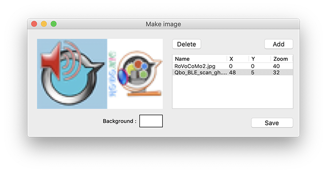
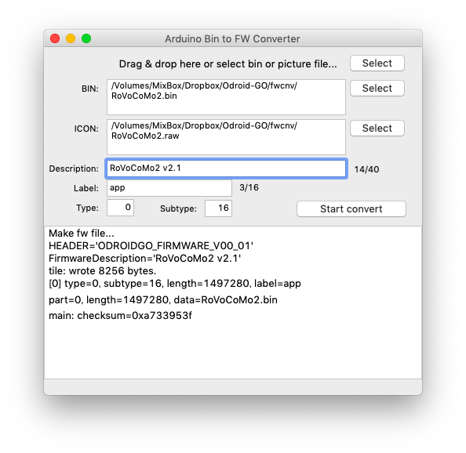
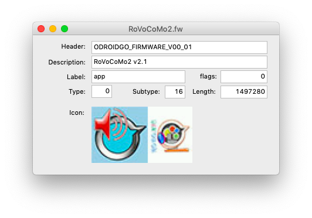

# FWConverter (Mac & Win)
### ---> Download [here](https://github.com/micutil/Odroid-GO_FWConverter/releases)

FWConverter is the converting application. You can convert a android bin file that build for Odroid-ESP32 with arduino to fw file. See [Make Arduino Applications for ODROID-GO](https://wiki.odroid.com/odroid_go/arduino_app).

### Update

v1.2.1 (2020/3/22)

- [CHG] Include mkfw file in app (Mac)
- [CHG] Can select mkfw file.

v1.2.0 (2019/10/14)

- [NEW] Function for displaying fw file information.
- [MOD] Select bin and icon file separately.
- [MOD] Edit the description of fw file.

## How to use

### 1, Edit the icon for FW file.

1. File menu -> New Icon editor
2. Add images.
3. Set buckground color (click the center of rectangle).
4. Set the top-left position with x, y value in listbox.
5. Set the zoom (%) in listbox.
6. Save.

### 2, Convert bin to FW file.

1: bin and picture file are same name...

- Make a bin file and a picture file (jpg, png, tiff or color565 raw file), then, these files place in a same folder and same name. Their file names have to be same, like 12345.bin and 12345.jpg.
- You just drag & drop the picture file (or bin file) to fw convert window of FWConverter or icon of FWConverter app.
- Edit description if necessary.
- Then, bush "Start convert" button.

2: bin and picture files aren't same name...

- Select bin file.
- Select Icon file.
- Edit description if necessary.
- Then, bush "Start convert" button.

### 3, Display FW file information.

1. File -> FW Information...
2. Select fw file.

- You can show the information with drag & drop to FWConverter app icon.

## Version history

- Fixed bug of the opening for icon editor (v1.1.3: 2019/10/9).
- In case of the selected a bin file. if there's not a image file of the same name of bin, opening dialog for select image (v1.1.3: 2019/10/9).
- You can now drop files in the shell console field of the main window (v1.1.2: 2019/10/7).
- Fixed a bug that the fwcnv file that became unnecessary in v1.1 does not start unless it is in the "tool" folder (v1.1.1: 2019/10/7).
- Included the Windows version (v1.1.0: 2019/10/5).
- 86x48 pixel icon picture editor (v1.1.0: 2019/10/5). 

## License

CC 4.0 BY Micono @ https://github.com/micutil/FWConverter
